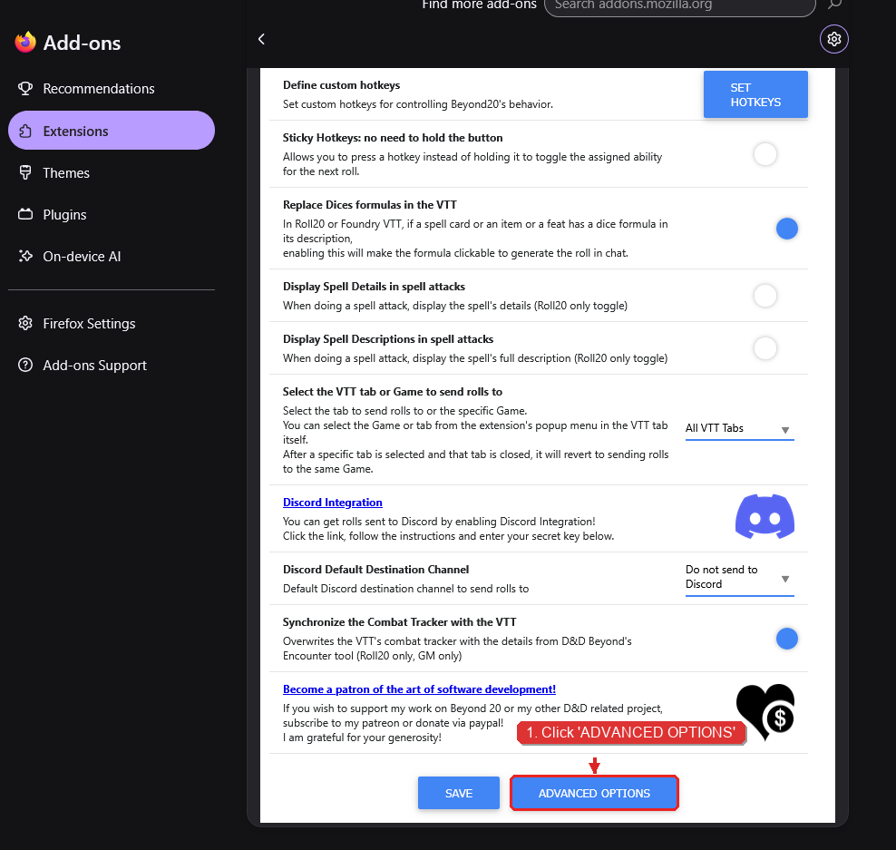
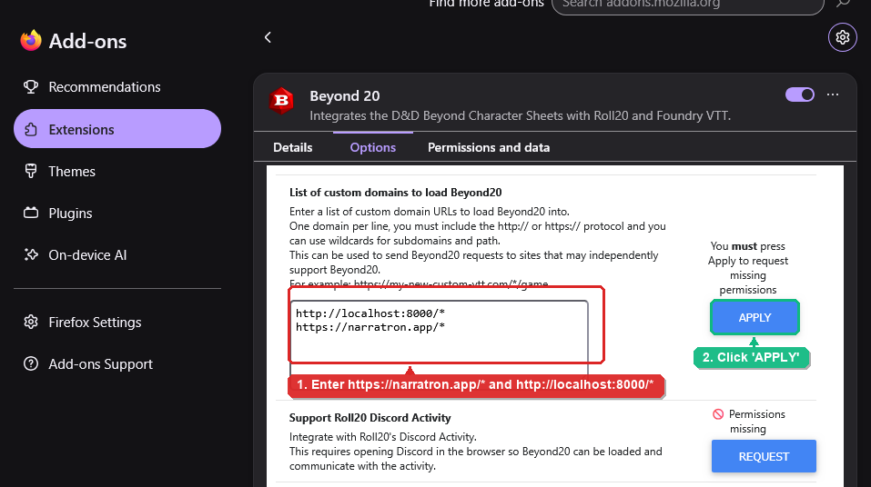

# Using Beyond20 with a Narratron canvas

[Beyond20](https://beyond20.here-for-more.info/) lets you roll from a D&D Beyond character sheet and share the result with your table. Narratron can display those rolls as cards in the canvas chat and, when collaboration is enabled, pass the result to the live narrative assistant.

## Before you begin

You need all of the following:

- Latest version of Beyond20.
- A D&D Beyond character sheet open in the same browser profile as Beyond20.
- The Narratron canvas open in another tab in that same browser profile.
- Permission to act as an orator in that theater. The theater owner, the active orator, and users in the theater's contributors list can send rolls. Spectators cannot publish a roll to the shared chat.

## Set up the extension

1. Install or update the Beyond20 extension in your browser, then open the extension's **Options** or **Settings** page (e.g. via your browser's extension manager or the Beyond20 toolbar menu).
2. Scroll to the bottom of the Beyond20 settings page and click the blue **ADVANCED OPTIONS** button:

   

3. On the Advanced Options page, locate the **List of custom domains to load Beyond20** text area. Enter the Narratron domain URLs (one per line):
   ```text
   https://narratron.app/*
   http://localhost:8000/*
   ```
4. Click the blue **APPLY** button directly next to the text box to request and grant the required browser site permissions:

   

5. Open the Narratron canvas for the theater in one browser tab and sign in with an account that has orator or contributor access. Keep this tab open for the session.
6. Open your D&D Beyond character sheet in a separate tab within the same browser profile.
7. Reload both the canvas tab and the character-sheet tab to ensure the browser extension activates on the newly authorized domain.


## Roll during play

Use a Beyond20 roll control on the D&D Beyond sheet as you normally would: select an ability, skill, save, attack, spell, or supported dice expression and use the Beyond20 roll button.

Narratron adds the completed result to the canvas chat as a dice card. It includes available attack/check totals, critical successes or failures, and damage totals. HP updates emitted by Beyond20 are also added to chat.

## Let the narrative assistant react to rolls

In the canvas, turn on **Viewer collaboration** for the theater. When it is enabled, an authorized orator's completed Beyond20 roll is also sent to the live narrative assistant as a concise D&D dice-roll message. With collaboration turned off, rolls remain visible in chat but are not sent to the narrative assistant.

This division is deliberate: the extension can be useful as a public dice log without triggering the narrative assistant unless the host has enabled collaborative input.

## Troubleshooting

### No roll appears in the canvas

- Confirm that the canvas and D&D Beyond are open in the same browser profile where Beyond20 is installed.
- Confirm the extension has permission to run on the Narratron host, then reload both tabs.
- Verify that you are the theater owner, active orator, or are listed as an contributor. Viewer accounts are blocked from publishing extension roll events.
- Check that the Narratron-enabled build is installed. A standard Beyond20 release without the Narratron destination cannot deliver events to the canvas.

### The roll appears in chat but Narratron does not react

Enable Viewer collaboration in the canvas. Chat display does not require collaboration; forwarding a result to the live narrative assistant does.

### I changed permissions or destinations and it still does not work

Reload the Narratron canvas and D&D Beyond character sheet. Browser extensions normally inject their page integration when a tab loads.

## Privacy and table etiquette

Roll details are shared with everyone who can view the theater chat. Treat a roll as table-visible before sending it. Beyond20 whisper behavior and any private information available to the extension should be configured in Beyond20 before rolling.

## Related guides

- [Using Narratron as a Virtual Tabletop (VTT)](/docs/virtual-tabletop)

